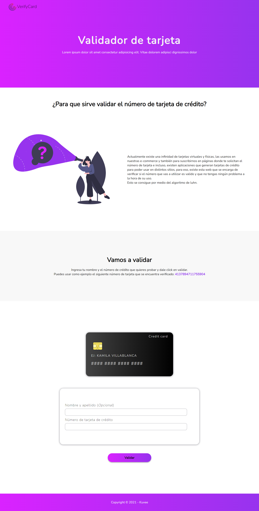
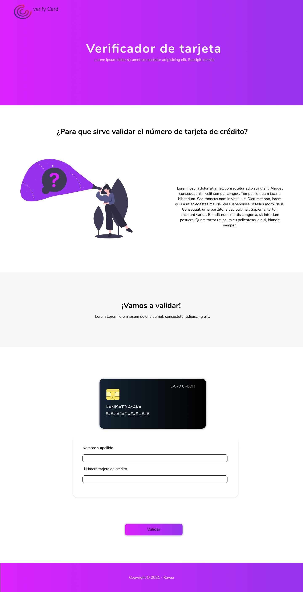

# VerifyCard 

## Link proyecto:
   [https://kamivillabla.github.io/cardValidation/](https://kamivillabla.github.io/cardValidation/)

## 1. RESUMEN DEL PROYECTO

Verify Card, es una página web donde puedes ingresar el número de tu tarjeta y verificar que sea un número valido.

# 2. Investigación UX:
## 2.1 ¿Quiénes son los principales usuarios de producto?

Personas mayores de 18 años que tengan acceso a tarjetas de crédito físicas y/o virtuales.

## 2.2 ¿Cuáles son los objetivos de estos usuarios en relación con tu producto? 

Buscan una solución para saber si el número de su tarjeta de crédito virtual o física se puede verificar.  

## 2.3 ¿Cómo crees que el producto que estás creando está resolviendo sus problemas? 

Dando la la posibilidad de poder ingresar el número de la tarjeta y por medio del algoritmo de luhn saber si es valida.

## 2.4 Prototipo en papel.

## 2.5 Feedback recibido.

* datos a poner
* datos a poner

## 2.6  Prototipo final.

# 3. Herramientas de elaboración del proyecto

HTML, CSS, javaScript.

